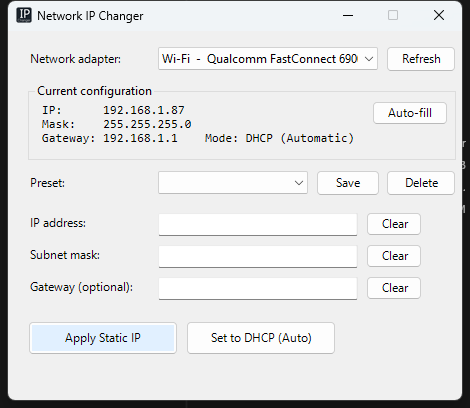

# Network IP Changer

A one-click Windows app to set a **static IPv4 address / subnet / gateway** on any
network adapter (Wi-Fi, Ethernet, USB dongles), or flip it back to **automatic (DHCP)** —
without digging through the legacy Control Panel windows.

Built for quickly hopping between static audio networks (Dante, consoles, etc.) and
regular DHCP networks.

No installer, no third-party tools — it's plain Windows PowerShell, which every Windows
10/11 machine already has.

---

## 1. Download it

1. Click the green **`< > Code`** button at the top of this page → **Download ZIP**.
2. Find the ZIP in your Downloads folder, right-click it → **Extract All…**.
3. Move the extracted folder (it'll be called **`Network-IP-Changer-main`**) somewhere
   permanent — your Desktop or Documents is fine. (Don't run it from inside the ZIP.)

> **Windows may warn you** that the files came from the internet. That's normal for any
> downloaded script. If a file is blocked, right-click it → **Properties** → tick
> **Unblock** → OK.

## 2. Run it

**Double-click `Launch Network IP Changer.cmd`.** That's it. The tool asks for admin
(UAC) and opens the window.

> **Always launch the `.cmd` files by double-clicking them.** Windows normally blocks
> running `.ps1` files directly (they flash red and vanish), so every task below has a
> `.cmd` wrapper that runs it correctly. Don't use "Run with PowerShell" on the `.ps1` files.

## 3. Use it

1. Pick the **adapter** from the dropdown. Its current IP / mask / gateway / mode is shown.
2. Then either:
   - **Type** an IP address (the subnet mask auto-fills, like the old Windows dialog), an
     optional gateway, then click **Apply Static IP**, or
   - Pick a saved **Preset** from the dropdown to fill the fields instantly, then Apply, or
   - Click **Auto-fill** (top-right of the Current configuration box) to drop the adapter's
     *current* live IP / mask / gateway straight into the fields.
3. Click **Set to DHCP (Auto)** to hand the adapter back to automatic addressing.

Each field has a small **Clear** button to wipe just that field.

## Presets

- **Auto-fill** then **Save** is the fast way to store an adapter's current settings as a
  preset without typing anything.
- Or fill in the fields manually, click **Save**, and give it a name (e.g. `Dante 192.168.1.x`,
  `Console 10.0.0.x`).
- Saved presets are stored in **`profiles.json`** next to the script — back it up or
  edit it directly if you like. (It isn't included in the download; it's created the
  first time you save a preset.)
- **Delete** removes the selected preset.

## Optional: skip the admin prompt

Tired of the UAC prompt every time? Double-click **`Turn off Admin Permission Popup.cmd`**
once (approve admin **one** time). It:

- registers a Scheduled Task that runs the app elevated in your session, and
- puts a **"Network IP Changer"** shortcut (with the custom icon) on your Desktop that
  opens the app **instantly, with no prompt and no console flash**.

Right-click that shortcut → **Pin to taskbar / Start** for true one-click access.

To undo it and go back to the normal admin prompt, double-click
**`Re-Enable Admin Permission Popup.cmd`**.

> Security note: this pre-authorises *this app* to run elevated silently — the trade-off
> for skipping the prompt. If you move the folder, re-run `Turn off Admin Permission Popup.cmd`.

## Optional: a plain shortcut (keeps the admin prompt)

1. Double-click **`Make Desktop Shortcut.cmd`**.
2. A **"Network IP Changer"** shortcut appears on your Desktop.
3. Right-click it → **Pin to taskbar** (or Pin to Start).

## If it doesn't open

The tool writes any startup error to **`error.log`** next to the scripts and also shows a
popup describing the problem. Open `error.log` (or double-click the `.cmd`, whose window
stays open on error) and share what it says.

## What's in the folder

| File | Purpose |
|------|---------|
| `Launch Network IP Changer.cmd` | **Start here.** Foolproof double-click launcher. |
| `Turn off Admin Permission Popup.cmd` | Double-click to set up no-admin-prompt launch. |
| `Re-Enable Admin Permission Popup.cmd` | Double-click to undo the no-prompt setup. |
| `Make Desktop Shortcut.cmd` | Double-click to make a plain Desktop shortcut. |
| `NetworkIPChanger.ps1` | The app itself (self-elevating WinForms GUI). |
| `Setup-NoPrompt.ps1` / `Remove-NoPrompt.ps1` / `Create-Shortcut.ps1` | The PowerShell the `.cmd` files run — don't launch these directly. |
| `app.ico` / `AppIcon.ico` | The app icon. |

## Notes

- Only IPv4 is changed; IPv6 is left untouched.
- Changing IPs requires administrator rights — that's why there's a UAC prompt.
- If a gateway is set, it must be reachable within the subnet you entered, or Windows
  will reject it (the app shows the error).
- Tested on Windows 11. Should work on Windows 10.

## License

MIT — see [LICENSE](LICENSE). Use it, share it, change it.
